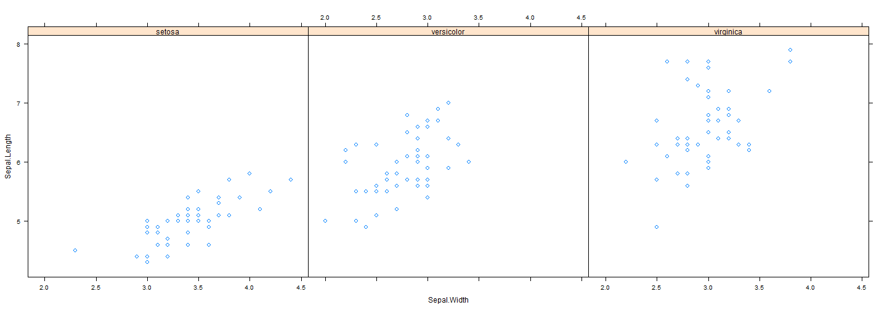
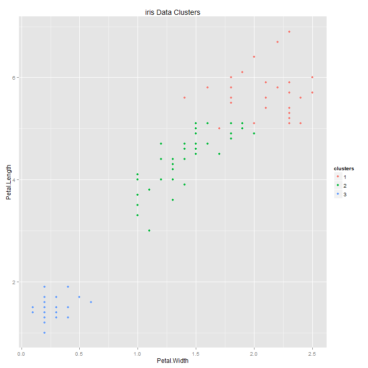

Unsupervised prediction by KMeans Algorithm
========================================================
author: HamideH Iraj
date: 2014-07-21

What is Unsupervised Learning
========================================================

Sometimes You don't know the label for prediction. To build a predictor

- Create Clusters
- Name Clusters
- Build predictor for clusters

In a new data set:
- Predict Clusters

Introduction to iris Data
========================================================


```r
data(iris)
head(iris)
```

```
  Sepal.Length Sepal.Width Petal.Length Petal.Width Species
1          5.1         3.5          1.4         0.2  setosa
2          4.9         3.0          1.4         0.2  setosa
3          4.7         3.2          1.3         0.2  setosa
4          4.6         3.1          1.5         0.2  setosa
5          5.0         3.6          1.4         0.2  setosa
6          5.4         3.9          1.7         0.4  setosa
```


Take a Second Look at iris Data
========================================================

```r
library(lattice)
xyplot(Sepal.Length ~ Sepal.Width | Species, data=iris,layout = c(3, 1),cex=1,size=20)
```

 


Unsupervised Clustering by KMeans
========================================================
 


